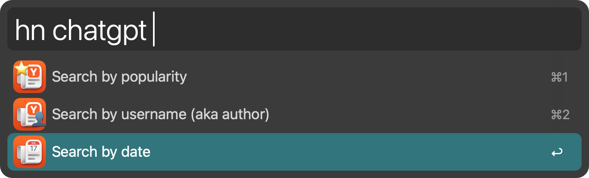
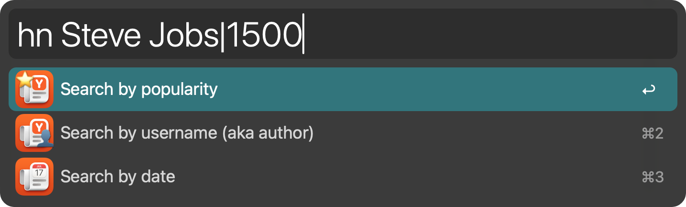
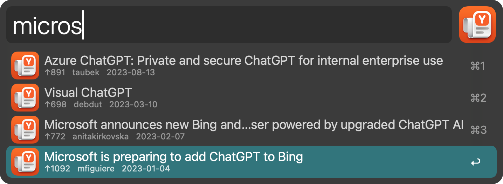
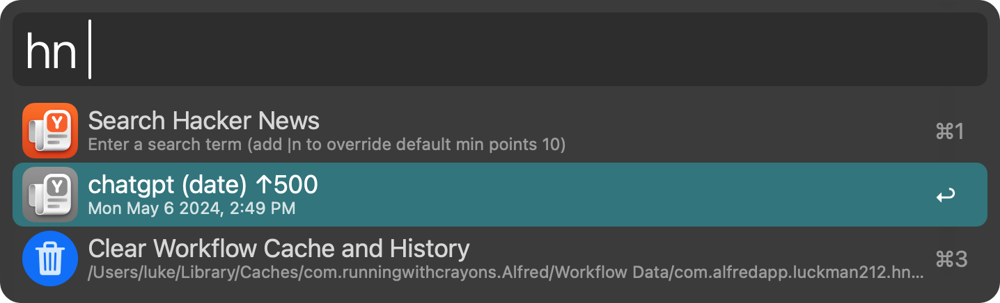
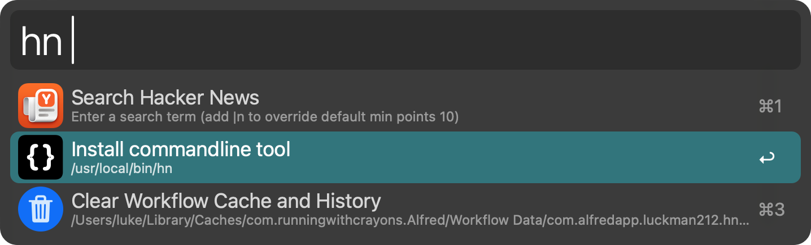
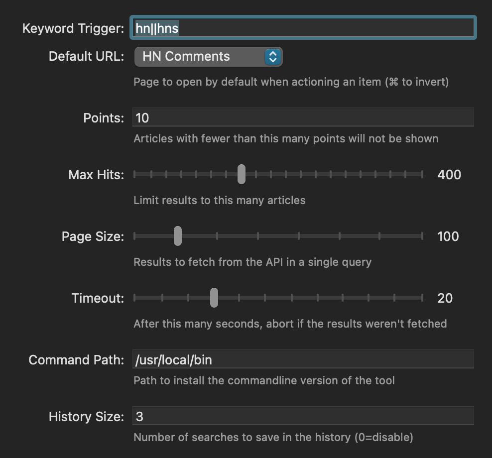
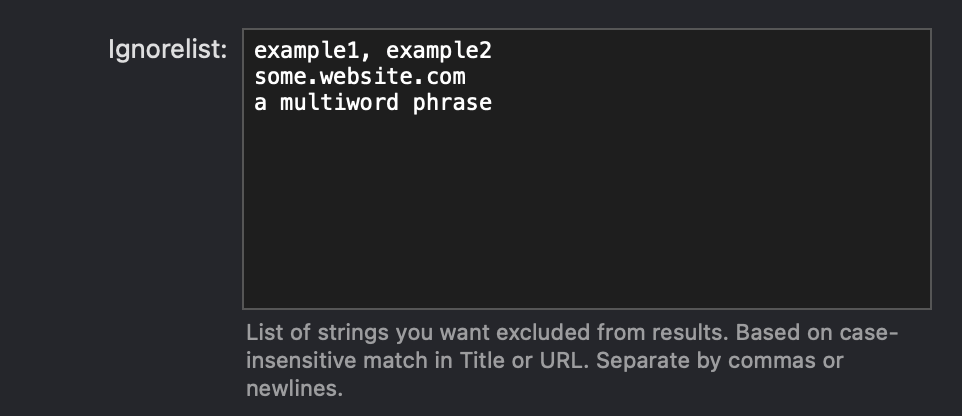

# HN Search

Search [Hacker News](https://news.ycombinator.com) (Y Combinator) and open articles or comment pages.

> **N.B.** This is the first release! It may contain bugs or edge cases that I didn't plan for or encounter during my testing. Please [report any issues](https://github.com/luckman212/alfred-hnsearch/issues) you experience!

## Installation / Dependencies

Install the workflow as you typically would, by double-clicking the **HNSearch.alfredworkflow** file.

Once installed, you can configure the settings using Alfred's standard Configure Workflow button. A few small dependencies will be automatically installed if they're not already loaded on your system. Currently, the dependencies are:

- `jq` for parsing and handling JSON inside some of the scripts
- `fzf` (for displaying nice menus in Terminal)
- `sponge` (part of moreutils) for efficiently aggregating the paginated API results

## Usage

Activate the workflow using your preferred trigger or hotkey, and follow the prompts. Type a search query and choose the kind of search you want to execute (points, date or author):



You can temporarily override the **Minimum Points** setting by adding a suffix in the form of `|<# of points>`. For example, to search for stories about *Steve Jobs* that have at least **1500** points:



Once results are displayed, you can further filter the items by typing additional keywords in Alfred. The **Title**, **Author**, **URL**, and **Date** fields will be used for matching.



In the subtitle, you will see the number of points, the user who submitted the story, and the date of submission.

## Modifier Keys

You can use modifier keys while a story is selected to display more info or take additional actions:
|Key|Function|
|---|---|
|<kbd>⌃CTRL</kbd>|copy item as Markdown link|
|<kbd>⌥OPT</kbd>|show/toggle opening alternate URL (comments/article)|
|<kbd>⌘CMD</kbd>|show URL|
|<kbd>⇧SHIFT</kbd>|use QuickLook to preview page (note: this can be slow)|

## Cache and History

Results that are fetched via the API are cached for a few minutes to speed up filtering and repeat searches.

By default, searches that you execute will be saved in a small history file for convenience. The default is to retain the last `3` searches. You can increase or disable this if desired. Set **History Size** to `0` to disable.

When you activate the workflow, items from the history are shown, and can be re-executed by simply pressing <kbd>ENTER</kbd>. Alternately, you can **edit** the search by holding the <kbd>⌥OPTION</kbd> key while actioning the history item.



## Commandline

The workflow comes with a companion CLI tool for searching from Terminal.

Most configuration variables/settings are shared between Alfred and the commandline version, so you can alternate between them.

When you first run the workflow, if the CLI is not installed, an option to install it will be shown:



A symlink, named the same as your keyword trigger, will be created in `/usr/local/bin` by default. You can configure a different target directory in the Workflow configuration if needed. If you've defined multiple trigger keywords (e.g. `hn||hns`) then the symlink name is derived from the FIRST keyword.

To see the full help/usage, run `hn --help`

```text
Query Hacker News — https://news.ycombinator.com
  via Algolia API — https://hn.algolia.com/api

usage: hn [opts] [title]
    -p,--popularity    sort by points (if omitted, sort by date)
    -t,--type <type>   type: story (default), comment, show_hn, ask_hn - see docs
    -m,--min <pts>     minimum points (default: 10)
    -u,--user <user>   search by username aka author
    -x,--hits <hits>   max results (default: 400)
    -n,--no-browse     don't open in browser
    -y,--allow-typos   fuzzy matching on misspelled words
    -r,--url           restrict matching to URL
    --nohistory        do not save search to history
    --noignore         do not consider ignorelist
    --lib [args]       perform action using hnlib Python library

    selected items will be:
      - output to the screen
      - opened in browser (unless -n flag is passed)
      - copied to the pasteboard in Markdown format

    tip: perform multi-word searches by quoting, exclude words with `-` e.g.
      hn 'Microsoft acquire -Blizzard'
```

## Configuration

Below is a sample of the configuration options available. These are the defaults.



An Ignorelist (exclusion) feature is available to hide unwanted items from your search results. Separate the terms with either commas or newlines.



## Additional Environment Variables

You probably don't need to change these...

- `HNS_SPINNER_MSG`
- `HNS_SPINNER_REFRESH`: interval for the realtime results display to update)
- `HNS_CACHE_RESULTS` (search results will be instantly recalled for this many seconds, set to `0` to disable)

## Icon

The main icons were adapted from https://www.pixelresort.com/project/hackernews. If there is any issue with this, please contact me.
